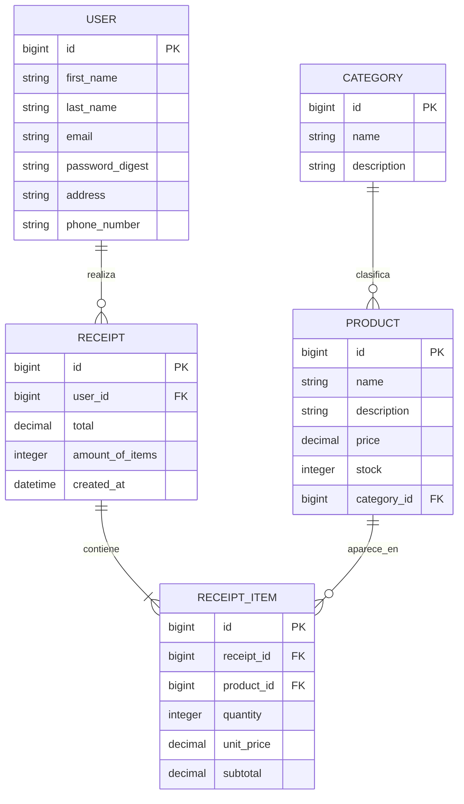

# Grupo 7 — API REST de E-commerce con Ruby on Rails

Backend RESTful para un sistema de e-commerce desarrollado con **Ruby on Rails en modo API**, **ActiveRecord**, **PostgreSQL**, **JWT** y **BCrypt**.

La solución implementa las entidades y reglas de negocio solicitadas para el Grupo 7: usuarios, productos, recibos y detalles de compra. También incluye categorías como funcionalidad adicional, manejo centralizado de errores, validaciones, migraciones, pruebas automatizadas y una colección Postman documentada.

---

## 1. Estado del proyecto

| Componente | Estado |
|---|---|
| Usuarios y autenticación JWT | Implementado |
| CRUD de productos | Implementado |
| Categorías | Implementado como valor agregado |
| Recibos y detalles de compra | Implementado |
| Cálculo del total en backend | Implementado |
| Validación y descuento de stock | Implementado |
| Manejo centralizado de errores | Implementado |
| Migraciones PostgreSQL | Implementado |
| Pruebas automatizadas | 44 pruebas, sin fallos |
| Colección Postman | Incluida |
| Swagger/OpenAPI | Sustituido por Postman documentado |

---

## 2. Tecnologías utilizadas

- Ruby 3.2
- Ruby on Rails 7.1, modo API
- ActiveRecord
- PostgreSQL
- JWT
- BCrypt
- Minitest
- Postman
- Git y GitHub

---

## 3. Funcionalidades principales

### Usuarios y seguridad

- Registro de usuarios.
- Inicio de sesión con correo y contraseña.
- Contraseñas almacenadas mediante BCrypt en `password_digest`.
- Generación de JWT con expiración.
- Consulta, actualización y eliminación de la propia cuenta.
- Protección contra acceso a cuentas de otros usuarios.
- Manejo de token ausente, inválido o vencido.
- Exclusión de contraseñas y credenciales en las respuestas JSON.

### Productos

- Crear, listar, consultar, actualizar y eliminar productos.
- Validación de nombre, descripción, precio y stock.
- Precio almacenado como decimal.
- Búsqueda por texto.
- Filtro por categoría.
- Filtro por rango de precios.
- Filtro por disponibilidad de inventario.

### Categorías

- Crear, listar, consultar, actualizar y eliminar categorías.
- Asociación opcional entre `Product` y `Category`.
- Nombre único sin distinguir mayúsculas y minúsculas.

### Recibos y compras

- Creación de recibos para el usuario autenticado.
- Detalle de productos mediante `ReceiptItem`.
- Obtención del precio real desde PostgreSQL.
- Cálculo de subtotales y total en el backend.
- Validación de cantidades y stock disponible.
- Descuento automático del stock.
- Agrupación de productos repetidos en una misma compra.
- Uso de transacciones para evitar compras incompletas.
- Bloqueo de filas de productos durante la compra.
- Listado y consulta de recibos del usuario autenticado.
- Protección contra acceso a recibos ajenos.
- Restauración del stock al eliminar un recibo.

---

## 4. Arquitectura

El proyecto aplica una separación clara de responsabilidades equivalente a una arquitectura por capas.

```text
app/
├── controllers/
│   ├── application_controller.rb
│   └── api/
│       ├── auth_controller.rb
│       ├── users_controller.rb
│       ├── products_controller.rb
│       ├── categories_controller.rb
│       └── receipts_controller.rb
├── models/
│   ├── user.rb
│   ├── product.rb
│   ├── category.rb
│   ├── receipt.rb
│   └── receipt_item.rb
├── services/
│   ├── json_web_token.rb
│   └── receipts/
│       ├── create_service.rb
│       └── delete_service.rb
├── serializers/
│   ├── user_serializer.rb
│   └── receipt_serializer.rb
└── errors/
    └── business_rule_error.rb
```

### Responsabilidades

| Capa o componente | Responsabilidad |
|---|---|
| Controllers | Reciben solicitudes HTTP, validan autorización y generan respuestas JSON |
| Models | Representan entidades, relaciones y validaciones del dominio |
| Services | Contienen la lógica de JWT y las transacciones de compra |
| Serializers | Definen estructuras de salida equivalentes a DTOs |
| Errors | Representan errores de reglas de negocio |
| ApplicationController | Centraliza autenticación y respuestas de error |
| ActiveRecord | Gestiona persistencia, relaciones y transacciones con PostgreSQL |

---

## 5. Modelo de datos



### Relaciones

- Un `User` puede tener muchos `Receipt`.
- Un `Receipt` pertenece a un `User`.
- Un `Receipt` contiene muchos `ReceiptItem`.
- Un `ReceiptItem` pertenece a un `Receipt` y a un `Product`.
- Una `Category` puede clasificar muchos `Product`.
- Un `Product` puede pertenecer opcionalmente a una `Category`.

---

## 6. Reglas de negocio implementadas

1. El cliente no establece el total final de la compra.
2. El usuario del recibo se obtiene desde el JWT.
3. Los precios se consultan directamente en PostgreSQL.
4. Cada subtotal se calcula como `precio × cantidad`.
5. El total corresponde a la suma de los subtotales.
6. La cantidad debe ser un entero mayor que cero.
7. Todos los productos solicitados deben existir.
8. La compra se rechaza cuando el stock es insuficiente.
9. El stock se descuenta únicamente si la compra completa es válida.
10. Si una operación falla, la transacción revierte todos los cambios.
11. Las contraseñas se almacenan cifradas con BCrypt.
12. Las contraseñas no aparecen en las respuestas HTTP.
13. Los importes monetarios se almacenan mediante columnas `decimal`.
14. Los errores se devuelven con una estructura JSON uniforme.

---

## 7. Requisitos previos

- Ruby 3.2 o superior
- Rails 7.1
- PostgreSQL 17 o compatible
- Bundler
- Git
- Postman, para ejecutar la colección de pruebas

Comprobar versiones:

```bash
ruby --version
bundle --version
psql --version
```

---

## 8. Instalación y ejecución

### 8.1. Clonar el repositorio

```bash
git clone https://github.com/Vaziii/WebProyectoFinal.git
cd WebProyectoFinal
```

### 8.2. Instalar dependencias

```bash
bundle install
```

### 8.3. Crear el archivo de entorno

En Windows PowerShell:

```powershell
Copy-Item .env.example .env
```

En Linux o macOS:

```bash
cp .env.example .env
```

Configurar `.env`:

```env
DB_HOST=127.0.0.1
DB_PORT=5432
DB_USERNAME=postgres
DB_PASSWORD=your_postgresql_password
DB_NAME=grupo7_ecommerce_development
JWT_SECRET=generate_with_rails_secret
```

Generar una clave segura para JWT:

```bash
bundle exec rails secret
```

Copiar el valor generado en `JWT_SECRET`.

> El archivo `.env` contiene credenciales locales y no debe subirse al repositorio.

### 8.4. Preparar PostgreSQL

```bash
bundle exec rails db:create
bundle exec rails db:migrate
bundle exec rails db:seed
```

También puede utilizarse:

```bash
bundle exec rails db:prepare
```

### 8.5. Ejecutar el servidor

```bash
bundle exec rails server
```

URL base:

```text
http://localhost:3000
```

---

## 9. Autenticación

Las rutas protegidas requieren el encabezado:

```http
Authorization: Bearer TOKEN_JWT
```

El token se obtiene mediante:

```http
POST /api/users/login
```

Características del JWT:

- Firmado con `HS256`.
- Contiene el identificador del usuario.
- Expira después de 24 horas.
- Se valida en cada ruta protegida.
- Un token inválido o vencido produce `401 Unauthorized`.

---

## 10. Resumen de endpoints

### 10.1. Usuarios

| Método | Ruta | Autenticación | Descripción | Respuesta esperada |
|---|---|---:|---|---|
| POST | `/api/users/register` | No | Registrar usuario | `201 Created` |
| POST | `/api/users/login` | No | Iniciar sesión y obtener JWT | `200 OK` |
| GET | `/api/users/:id` | Sí | Consultar la propia cuenta | `200 OK` |
| PUT | `/api/users/:id` | Sí | Actualizar la propia cuenta | `200 OK` |
| DELETE | `/api/users/:id` | Sí | Eliminar la propia cuenta | `204 No Content` |

### 10.2. Productos

| Método | Ruta | Autenticación | Descripción | Respuesta esperada |
|---|---|---:|---|---|
| POST | `/api/products` | No | Crear producto | `201 Created` |
| GET | `/api/products` | No | Listar y filtrar productos | `200 OK` |
| GET | `/api/products/:id` | No | Consultar producto | `200 OK` |
| PUT | `/api/products/:id` | No | Actualizar producto | `200 OK` |
| DELETE | `/api/products/:id` | No | Eliminar producto | `204 No Content` |

### 10.3. Categorías

| Método | Ruta | Autenticación | Descripción |
|---|---|---:|---|
| POST | `/api/categories` | No | Crear categoría |
| GET | `/api/categories` | No | Listar categorías |
| GET | `/api/categories/:id` | No | Consultar categoría |
| PUT | `/api/categories/:id` | No | Actualizar categoría |
| DELETE | `/api/categories/:id` | No | Eliminar categoría |

### 10.4. Recibos

| Método | Ruta | Autenticación | Descripción | Respuesta esperada |
|---|---|---:|---|---|
| POST | `/api/receipts` | Sí | Crear compra y descontar stock | `201 Created` |
| GET | `/api/receipts` | Sí | Listar recibos del usuario autenticado | `200 OK` |
| GET | `/api/receipts/:id` | Sí | Consultar un recibo propio | `200 OK` |
| GET | `/api/receipts/user/:user_id` | Sí | Listar recibos del usuario indicado | `200 OK` |
| DELETE | `/api/receipts/:id` | Sí | Eliminar recibo y restaurar stock | `204 No Content` |

---

## 11. Ejemplos de uso

### 11.1. Registrar usuario

```http
POST /api/users/register
Content-Type: application/json
```

```json
{
  "firstName": "Ana",
  "lastName": "Perez",
  "email": "ana@correo.com",
  "password": "Clave123*",
  "passwordConfirmation": "Clave123*",
  "address": "Quito",
  "phoneNumber": "0991234567"
}
```

### 11.2. Iniciar sesión

```http
POST /api/users/login
Content-Type: application/json
```

```json
{
  "email": "ana@correo.com",
  "password": "Clave123*"
}
```

### 11.3. Crear producto

```http
POST /api/products
Content-Type: application/json
```

```json
{
  "product": {
    "name": "Teclado mecánico",
    "description": "Teclado USB con switches mecánicos",
    "price": 49.99,
    "stock": 15,
    "category_id": 1
  }
}
```

### 11.4. Buscar y filtrar productos

```http
GET /api/products?q=teclado&category_id=1&min_price=10&max_price=100&in_stock=true
```

Filtros disponibles:

| Parámetro | Descripción |
|---|---|
| `q` o `search` | Búsqueda por nombre o descripción |
| `category_id` | Filtrar por categoría |
| `min_price` | Precio mínimo |
| `max_price` | Precio máximo |
| `in_stock` | `true` para disponibles y `false` para agotados |

### 11.5. Crear recibo

```http
POST /api/receipts
Authorization: Bearer TOKEN_JWT
Content-Type: application/json
```

```json
{
  "items": [
    {
      "productId": 1,
      "quantity": 2
    },
    {
      "productId": 2,
      "quantity": 1
    }
  ]
}
```

El cliente no envía `userId`, `unitPrice`, `subtotal` ni `total`.

Respuesta de ejemplo:

```json
{
  "message": "Recibo creado correctamente",
  "data": {
    "receiptId": 1,
    "userId": 1,
    "total": "119.98",
    "amountOfItems": 3,
    "items": [
      {
        "receiptItemId": 1,
        "productId": 1,
        "productName": "Teclado mecánico",
        "quantity": 2,
        "unitPrice": "49.99",
        "subtotal": "99.98"
      },
      {
        "receiptItemId": 2,
        "productId": 2,
        "productName": "Mouse",
        "quantity": 1,
        "unitPrice": "20.0",
        "subtotal": "20.0"
      }
    ]
  }
}
```

---

## 12. Validaciones

### User

- `first_name`: obligatorio, máximo 80 caracteres.
- `last_name`: obligatorio, máximo 80 caracteres.
- `email`: obligatorio, válido y único sin distinguir mayúsculas.
- `password`: mínimo 8 caracteres.
- `password_confirmation`: debe coincidir con la contraseña cuando se envía.
- `phone_number`: opcional, entre 7 y 15 dígitos.
- El correo se normaliza a minúsculas.

### Product

- `name`: obligatorio, máximo 120 caracteres.
- `description`: opcional, máximo 1000 caracteres.
- `price`: obligatorio y mayor que cero.
- `stock`: obligatorio, entero y mayor o igual que cero.
- `category_id`: debe corresponder a una categoría existente cuando se envía.

### Category

- `name`: obligatorio, único y máximo 80 caracteres.
- `description`: opcional, máximo 500 caracteres.

### Receipt y ReceiptItem

- El recibo debe contener al menos un producto.
- `productId`: entero mayor que cero.
- `quantity`: entero mayor que cero.
- El producto debe existir.
- Debe existir stock suficiente.
- `unit_price`, `subtotal` y `total` se calculan en el backend.
- `amount_of_items` corresponde a la suma de cantidades.
- Un usuario solo puede consultar o eliminar sus propios recibos.

---

## 13. Formato de errores

La API mantiene una estructura uniforme:

```json
{
  "error": {
    "message": "Descripción general",
    "details": "Información adicional"
  }
}
```

### Validación fallida

```json
{
  "error": {
    "message": "Datos inválidos",
    "details": {
      "price": [
        "Price debe ser mayor que 0"
      ]
    }
  }
}
```

### Recurso inexistente

```json
{
  "error": {
    "message": "Recurso no encontrado",
    "details": "Couldn't find Product with 'id'=999"
  }
}
```

### Token ausente

```json
{
  "error": {
    "message": "No autorizado",
    "details": "Debes enviar un token en el encabezado Authorization"
  }
}
```

### Stock insuficiente

```json
{
  "error": {
    "message": "Stock insuficiente",
    "details": {
      "productId": 1,
      "productName": "Teclado mecánico",
      "requestedQuantity": 100,
      "availableStock": 10
    }
  }
}
```

---

## 14. Códigos de estado utilizados

| Código | Significado |
|---:|---|
| `200 OK` | Consulta o actualización exitosa |
| `201 Created` | Recurso creado |
| `204 No Content` | Recurso eliminado |
| `400 Bad Request` | Solicitud o parámetros inválidos |
| `401 Unauthorized` | Token ausente, inválido o vencido |
| `403 Forbidden` | Intento de acceder a un recurso ajeno |
| `404 Not Found` | Recurso inexistente |
| `422 Unprocessable Content` | Validación o regla de negocio incumplida |
| `500 Internal Server Error` | Error de configuración o servidor |

---

## 15. Pruebas automatizadas

Preparar la base de pruebas:

```bash
bundle exec rails db:test:prepare
```

Ejecutar toda la suite:

```bash
bundle exec rails test
```

Resultado final verificado:

```text
44 runs
151 assertions
0 failures
0 errors
0 skips
```

La suite cubre:

- Validaciones de `User`, `Receipt` y `ReceiptItem`.
- Normalización y duplicidad del correo.
- Cifrado BCrypt.
- Generación y decodificación de JWT.
- Registro, login y rutas protegidas.
- Consulta, actualización y eliminación de usuario.
- Creación transaccional de recibos.
- Cálculo del total con precios de PostgreSQL.
- Descuento automático del stock.
- Carrito vacío, cantidades inválidas y productos inexistentes.
- Stock insuficiente sin alteración de la base.
- Acceso a recibos propios y bloqueo de recibos ajenos.
- Eliminación del recibo y restauración del stock.

---

## 16. Colección Postman

Archivo:

```text
postman/Grupo7_Ecommerce_API.postman_collection.json
```

### Importación

1. Abrir Postman.
2. Seleccionar **Import**.
3. Elegir el archivo de la colección.
4. Configurar `base_url` como `http://localhost:3000`.
5. Ejecutar primero el registro y el login.
6. El login almacena automáticamente `token` y `user_id`.

### Carpetas incluidas

- `Users and Authentication`
- `Products`
- `Categories`
- `Receipts`

### Casos comprobados en Recibos

- Total calculado por el backend.
- Usuario obtenido desde JWT.
- Descuento automático de stock.
- Consulta y listado.
- Solicitud sin token.
- Carrito vacío.
- Stock insuficiente.
- Stock sin cambios después de un error.
- Eliminación del recibo.
- Restauración del stock.
- Confirmación `404` después de eliminar.

---

## 17. Migraciones

Consultar el estado:

```bash
bundle exec rails db:migrate:status
```

Las migraciones incluyen:

- Creación de usuarios.
- Creación de categorías.
- Creación de productos.
- Creación de recibos.
- Creación de detalles de recibo.
- Índices únicos y claves foráneas.
- Restricciones para montos y cantidades.

---


## 18. Notas de seguridad

- No subir `.env`.
- No compartir `DB_PASSWORD`.
- No guardar tokens JWT reales en Postman exportado.
- Usar una clave `JWT_SECRET` distinta en cada entorno.
- Cambiar las credenciales de ejemplo antes de desplegar.
- No utilizar contraseñas reales en capturas o documentación.

---

## 19. Comandos rápidos

```bash
bundle install
bundle exec rails db:prepare
bundle exec rails server
bundle exec rails test
bundle exec rails routes
```
